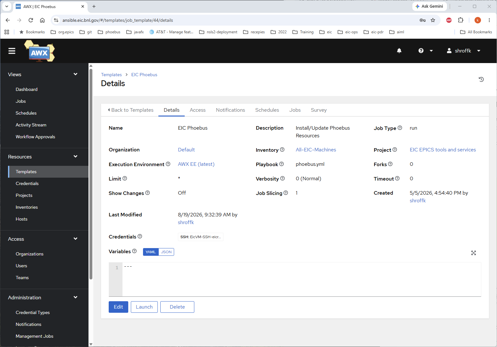
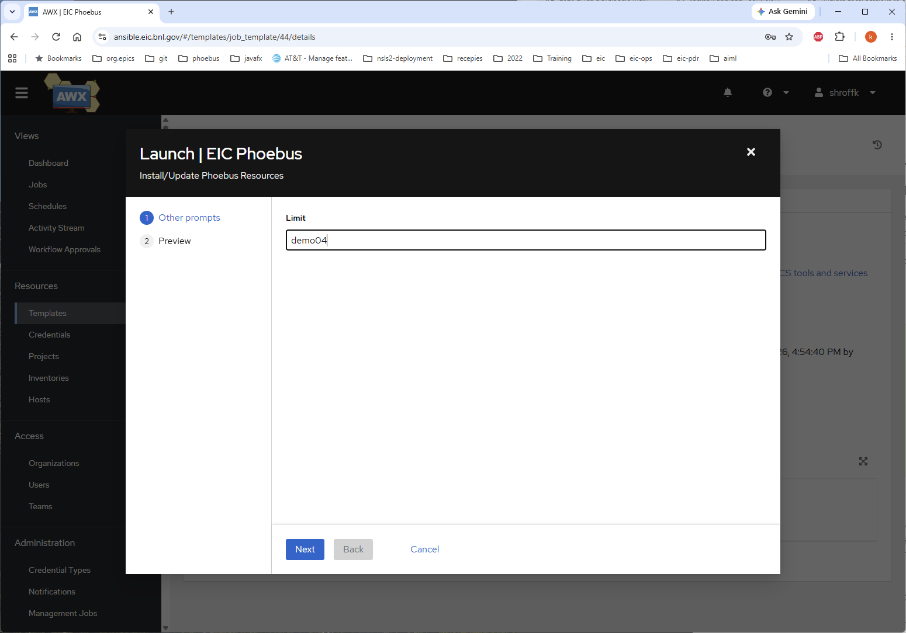

# Deployment Automation

Tools and services in the EIC infrastructure are deployed with a shared set of Ansible roles and playbooks. There are two ways to run them:

* **AWX** — a web UI on top of Ansible. This is the **preferred** way to deploy things: it provides curated job templates, centralized credentials, inventories, and a history of every job that has run. Start here.
* **Ansible CLI** — running the playbooks directly from the command line. This is retained for **testing and debugging**, and is useful when developing new roles/playbooks or troubleshooting a deployment.

---

## AWX (preferred)

[AWX](https://ansible.eic.bnl.gov) is the web front end for Ansible automation in the EIC infrastructure. It wraps the same roles and playbooks described below in reusable **job templates**, each pre-configured with the correct project, inventory, credentials, and playbook. Deploying a tool becomes a matter of launching the relevant template and, where prompted, supplying the target host.

Benefits over running the CLI directly:

* No need to install Ansible or manage SSH credentials locally — AWX stores them centrally.
* Consistent, curated inventories and variables.
* Every launch is logged, with full job output and history for auditing and troubleshooting.
* Role-based access control over who can run what.

### Deploying Phoebus with AWX

The **EIC Phoebus** job template installs/updates Phoebus resources. It is available here:

[https://ansible.eic.bnl.gov/#/templates/job_template/44/details](https://ansible.eic.bnl.gov/#/templates/job_template/44/details)

The template is pre-configured with:

* **Project:** EIC EPICS tools and services
* **Inventory:** All-EIC-Machines
* **Playbook:** `phoebus.yml`
* **Credentials:** SSH credentials for the EIC machines



To deploy Phoebus to a host:

1. Open the [EIC Phoebus template](https://ansible.eic.bnl.gov/#/templates/job_template/44/details).
2. Click **Launch**.
3. When prompted, set **Limit** to the target host (for example `demo04`). This restricts the deployment to just that host. Leave it blank (or `*`) to target the whole inventory.
4. Click **Next**, review the **Preview**, and launch the job.
5. Follow the job output in AWX to confirm the deployment completed successfully.



---

## Ansible CLI (testing and debugging)

> **Note:** For routine deployments, prefer the **AWX** method above. The command-line workflow below is preserved for testing, debugging, and developing the underlying roles and playbooks.

### Ansible Configuration and Usage

### 1. Ansible Controller: demo01.eic.bnl.gov

An Ansible controller is the central point for Ansible automation, where Ansible is installed to manage and orchestrate tasks across a network. It communicates with managed nodes via SSH, utilizing playbooks to define system states. This setup streamlines configuration management and application deployment, enabling administrators to automate repetitive tasks and ensure consistent configurations across their infrastructure.

**1.1 Ansible Installation**

```bash
# Install Ansible using package manager
sudo yum install ansible

# Install pipx (if not already installed)
sudo dnf install python3-pip python3-wheel

# Install pipx using pip
python3 -m pip install --user pipx

# Ensure pipx is in the user's PATH
python3 -m pipx ensurepath

# Install Ansible using pipx
pipx install --include-deps ansible

```

#### 1.2 Ansible Roles Repository

In your infrastructure, the generic Ansible roles, located in the Git repository at `/opt/ansible/ansible-epics-tools`, cover a range of deployment scenarios. These roles are designed for deploying EPICS (Experimental Physics and Industrial Control System), EPICS tools such as Phoebus, and middle-layer services.

#### 1.3 Deployment Playbooks and Inventory

Meanwhile, deployment playbooks and the inventory, specifying what is deployed where, are stored in another Git repository at `/opt/ansible/ansible-eic`. This separation allows for modular management, enabling the reuse of roles for various components and facilitating organized deployment configurations. It provides flexibility and ease of version control for both the generic roles and the specific deployment configurations.

### 2: Deploying EPICS with Ansible

To deploy EPICS in your infrastructure using Ansible, utilize the playbooks from the `ansible-eic` repository.

To initiate the deployment of EPICS base components, execute the following Ansible playbook command ():

```bash
ansible-playbook -i /opt/ansible/ansible-eic/inventory.ini --limit workstations -u root /opt/ansible/ansible-eic/epics-base.yml
```

* `-i inventory.ini`: Specifies the inventory file, defining the hosts involved in the deployment.
* `--limit workstations`: Limits the playbook execution to the specified host group, in this case, 'workstations'.
* `-u root`: Specifies the user (root in this case) that Ansible should use when connecting to the hosts.
* `/opt/ansible/ansible-eic/epics-base.yml`: Points to the location of the Ansible playbook named `epics-base.yml` within the `ansible-eic` repository.

### 3: Deploying Phoebus with Ansible

To deploy Phoebus in your infrastructure using Ansible, execute the following Ansible playbook command:

```bash
ansible-playbook -i /opt/ansible/ansible-eic/inventory.ini -u root /opt/ansible/ansible-eic/phoebus.yml
```

Adjust the parameters as needed for your specific deployment requirements. This playbook orchestrates the deployment of Phoebus on the specified hosts.

### 4: Deploying Phoebus Alarm Services

To deploy Phoebus Alarm Services in your infrastructure using Ansible, execute the following Ansible playbook command:

```bash
ansible-playbook -i /opt/ansible/ansible-eic/inventory.ini --limit alarm-server -u root /opt/ansible/ansible-eic/alarm.yml
```

Adjust the parameters as needed for your specific deployment requirements.

### 5: Deploying Archiver Appliance

To deploy Archiver Appliance Services in your infrastructure using Ansible, execute the following Ansible playbook command:

```bash
ansible-playbook -i /opt/ansible/ansible-eic/inventory.ini --limit alarm-server -u root /opt/ansible/ansible-eic/aa.yml
```

Adjust the parameters as needed for your specific deployment requirements.

### 6: Deploying Save and Restore

To deploy Save and Restore Services in your infrastructure using Ansible, execute the following Ansible playbook command:

```bash
ansible-playbook -i /opt/ansible/ansible-eic/inventory.ini --limit save-restore -u root /opt/ansible/ansible-eic/save_restore.yml
```

Adjust the parameters as needed for your specific deployment requirements.

### 7: Deploying Archiver Appliance

To deploy ChannelFinder Services in your infrastructure using Ansible, execute the following Ansible playbook command:

```bash
ansible-playbook -i /opt/ansible/ansible-eic/inventory.ini --limit channelfinder -u root /opt/ansible/ansible-eic/cf.yml
```

Adjust the parameters as needed for your specific deployment requirements.

