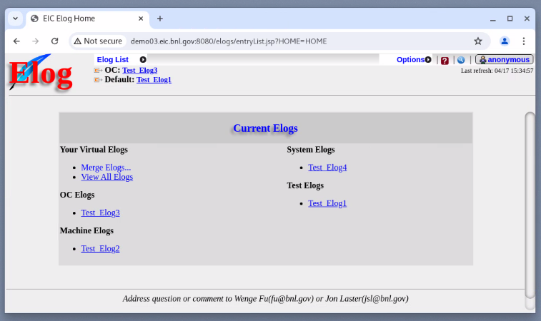

## How to Setup Standaline Elog Server for EIC Machine
### Zaiwen and Wenge

#### Background:
Request from Seth:
- How much effort will it take to install our elog server on an EIC host machine? 
- We want to set this up for evaluation purposes.  There is a linux host -- demo03.eic.bnl.gov
- There is nothing else on this VM and its purpose is to evaluate and experiment.
- Let me know if this is easy to install.  We would only be accessing it internally.

#### Solution: 
With Wenge's help, I have successfully setup a Standalone Elog Server for EIC on demo03.eic.bnl.gov:

http://demo03.eic.bnl.gov:8080/elogs/


#### Initial Consideration:

To setup a stndalone elog server is not very difficult. Normally it takes about 2 days:
https://www.cadops.bnl.gov/Controls/doc/SA/StandAlone/CreateMachine-SetupElogServer.html
 
There  are three concern:
First, this EIC machine is "CentOS Stream release 8" with kernel as "4.18.0-535".
CAD RH is RedHat 8.4 with kernel as "4.18.0-305".
Second, this VM is not a standard CAD Linux machine and thus had to install a lot more rpms including java/python/X server/browser/convert/gedit.
Third, our Standalone elog server procedure is for RH 7.6, not for Linux 8.Not sure if it will work for Linux   8.

#### Detailed  Steps:

NOTE: The steps below describes the EXTRA steps from this original setup document:
https://www.cadops.bnl.gov/Controls/doc/elogweb/OSS/Elog_Manual_For_Payara5.html

On csmaster, scp files over:
```bash
scp /home/cfsd/sysadmin/REPO/WS8-1.custom/jdk-8u301-linux-x64.rpm eicuser@demo03.eic.bnl.gov:/tmp/
scp /home/cfsd/sysadmin/REPO/WS8-1.custom/mysql*.rpm eicuser@demo03.eic.bnl.gov:/home/here/zaiwen/mysqlrpms/
scp /ride/database/mysql/Resources/Software/mysql-5.7.18/mysql-5.7.18-linux-glibc2.5-x86_64.tar.gz eicuser@demo.eic.bnl.gov:/home/here/mysql/
scp /ride/WebAppServers/Payara/payara-5.2020.6.zip eicuser@demo03.eic.bnl.gov:/home/here/payara520206/
scp /home/cfsd/sysadmin/ThirdPartyApp/firefox/firefox-121.0.tar.bz2  eicuser@demo03.eic.bnl.gov:/opt/
 scp /usr/controls/bin/PrintUtility* eicuser@demo03.eic.bnl.gov:/usr/cntrols/bin/
scp /home/cfsd/sysadmin/templates/Linux/Installation/Centrify580/installer/centrify-rhel6-x86_64.tar eicuser@demo03.eic.bnl.gov:/tmp/
```

#### On EIC demo03.eic.bnl.gov:

#### Install java:
```bash
#rpm -ivh jdk-8u301-linux-x64.rpm
#./zaiwen84-java.1.8.install.sh
```

#### Install mysql rpm to get local user "mysql":
```bash
#sudo rpm -ivh mysql-8.0.17-3.module+el8.0.0+3898+e09bb8de.x86_64.rpm mysql-common-8.0.17-3.module+el8.0.0+3898+e09bb8de.x86_64.rpm mysql-community-server-8.0.30-1.el8.x86_64.rpm mysql-community-client-8.0.30-1.el8.x86_64.rpm mysql-community-client-plugins-8.0.30-1.el8.x86_64.rpm mysql-community-libs-8.0.30-1.el8.x86_64.rpm mysql-community-common-8.0.30-1.el8.x86_64.rpm mysql-community-icu-data-files-8.0.30-1.el8.x86_64.rpm
```

#### Fix error for staring mysql due to EIC machine has a newer version of libncurse installed:
```bash
[eicuser@demo03 mysql]$ sudo bin/mysql -uroot -p
[sudo] password for eicuser: 
bin/mysql: error while loading shared libraries: libncurses.so.5: cannot open shared object file: No such file or directory


#### This error is because EIC machine has a newer version of libncurse installed. First find out what version of libncurses your distro has:
$ ls -1 /usr/lib64/libncurses*

so we make a symlink:
# sudo ln -s /usr/lib64/libncurses.so.6 /usr/lib64/libncurses.so.5
```

#### Fix empty root password problem:
We can't login as root without password.
Figured out it is RH8's more strict security polidy. If run with "--initialize-insecure", the initialization will be aborted.

For RH7:  
sudo bin/mysqld --initialize-insecure --user=mysql --basedir=/usr/local/mysql --datadir=/usr/local/mysql/dbdata
       2024-04-16T18:51:14.425070Z 1 [Warning] root@localhost is created with an empty password ! Please consider switching off the --initialize-insecure option.

For RH8: 
sudo bin/mysqld --initialize --user=mysql --basedir=/usr/local/mysql --datadir=/usr/local/mysql/dbdata
       2024-04-17T15:41:07.668315Z 1 [Note] A temporary password is generated for root@localhost: -p7>6#lowDOw

#### Fix password policy:
Finally we can login as root. Now reset password
Reset password:  ALTER USER 'root'@'localhost' IDENTIFIED BY 'root';
This failed...
https://www.cadops.bnl.gov/Controls/doc/SA/Install_mysql.html
ALTER USER 'root'@'localhost' IDENTIFIED BY 'YourComplicatedPassword';
You have to run this command first to set root password.
And you have to give a complicated password such as Password123!@#
Later you can change it to a simple password after you lower the password requirement.
SET GLOBAL validate_password_policy=LOW;
SET GLOBAL validate_password_length=4;
ALTER USER 'root'@'localhost' IDENTIFIED BY 'root';

#### Install google chrome:
https://linuxize.com/post/how-to-install-google-chrome-web-browser-on-centos-8/
```bash
wget https://dl.google.com/linux/direct/google-chrome-stable_current_x86_64.rpm
sudo dnf localinstall google-chrome-stable_current_x86_64.rpm
```

#### Install X server
```bash
sudo yum install xorg-x11-server-Xorg xorg-x11-xauth
Install convert
sudo yum install ImageMagick
```

#### Install Python
```bash
sudo yum install python3
sudo ln -s /usr/bin/python3 /usr/bin/python
```

#### Copy  /usr/controls/bin/PrintUtility and  /usr/controls/bin/PrintUtilityLocal over
Update hostname/port in the file

#### Install tcsh
yum install tcsh

#### Install autofs
yum install autofs

vi /etc/auto.master

       /cfs    /etc/auto.cfs   --timeout 60 --vers=3

vi /etc/auto.cfs

       ad   -rw,hard,intr cfsd.pbn.bnl.gov:/cfsad

systemctl enable autofs

systemctl start autofs

Add demo03.eic.bnl.gov to netgroup

sudo ln -s /cfs/ad /home/cfsa

sudo ln -s /cfs/ad /home/cfsad

sudo ln -s /cfs/ad /home/cfsd

BUT, demo03.eic.bnl.gov can't ping cfsd.pbn.bnl.gov

#### Install Centrify
```bash
On csmaster -- scp /home/cfsd/sysadmin/templates/Linux/Installation/Centrify580/installer/centrify-rhel6-x86_64.tar eicuser@demo03.eic.bnl.gov:/tmp/
sudo tar xvf centrify-rhel6-x86_64.tar
sudo rpm -ivh CentrifyDC-5.8.0-188-rhel6.x86_64.rpm CentrifyDC-openssl-5.8.0-188-rhel6.x86_64.rpm CentrifyDC-curl-5.8.0-188-rhel6.x86_64.rpm CentrifyDC-openldap-5.8.0-188-rhel6.x86_64.rpm
sudo adjoin -c "cn=CAD-CON, ou=Centrify, ou=Research Enclave" --zone CAD-CON -u cadcentr  bnl.gov --force
sudo adlicense -t workstation
sudo adinfo
update /etc/nsswitch using template /home/cfsd/sysadmin/templates/Linux/etc/nsswitch.conf
update /etc/centrifydc/centrifydc.conf using template /home/cfsd/sysadmin/templates/Linux/etc/centrifydc/centrifydc.conf.rh84
systemctl restart centrifydc
```


