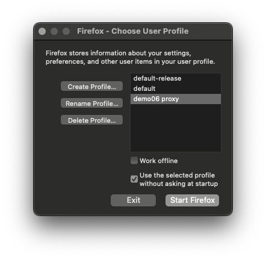
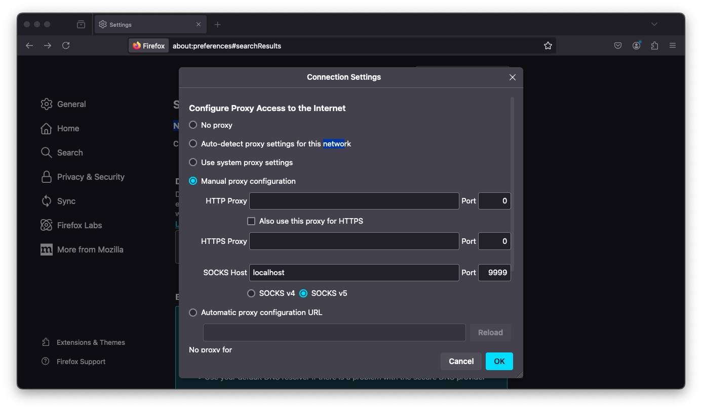

# Firefox for Demo Machines

This tutorial will help avoid laggy connections with web browsers on the demo machines. 

### 1. Setup firefox profile
Using the command firefox -p will bring up a prompt to choose a user profile.


Create a new profile and choose a name. In this example, we are working with demo06. Open this profile. In the search box enter: "about:config".

You will be prompted with a "Search Preference Name" box. Search for "hijack" and toggle it to True.

Open up the firefox settings and select Manual proxy configuration. Use the SOCKS host. Enter localhost and port 9999. Make sure Proxy DNS when using SOCKS v5 is checked.


Now ssh in your desired machine.
``` bash
ssh -X user@demo0X.eic.bnl.gov -D 9999
```

Make sure to always open firefox with your newly created profile. 