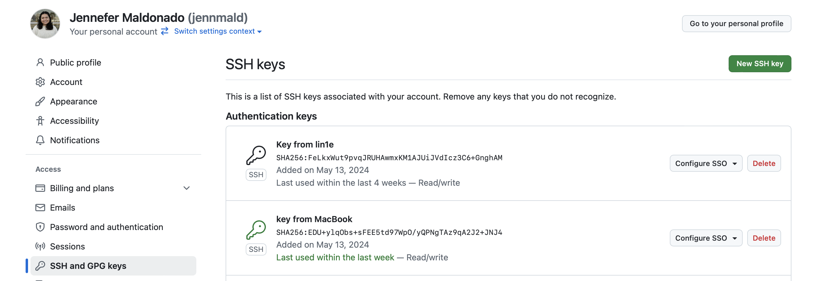
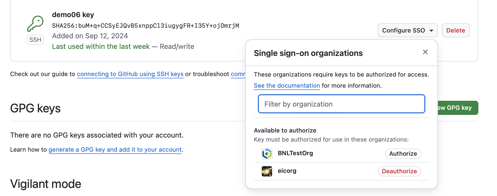

# Using Git on demo machines

Ssh into your demo machine of choice.
``` bash
ssh jmaldonad@demo06.eic.bnl.gov
jmaldonad@demo06.eic.bnl.gov's password: 
Activate the web console with: systemctl enable --now cockpit.socket

Last login: Fri Sep  6 11:31:44 2024 from 130.199.104.45
[jmaldonad@demo06 ~]$
```

If your github account does not have an ssh key associated with this machine, trying to git clone a project will be denied.

``` bash
[jmaldonad@demo06 project]$ git clone git@github.com:eicorg/ghaction.git
Cloning into 'ghaction'...

git@github.com: Permission denied (publickey).
fatal: Could not read from remote repository.

Please make sure you have the correct access rights
and the repository exists.

```
This means you need an ssh key from your github specifically linked to this machine.

``` bash
[jmaldonad@demo06 project]$ ssh-keygen -t ed25519 -C "jmaldonad@bnl.gov"
Generating public/private ed25519 key pair.
Enter file in which to save the key (/home/jmaldonad/.ssh/id_ed25519): 
Enter passphrase (empty for no passphrase): 
Enter same passphrase again: 
Your identification has been saved in /home/jmaldonad/.ssh/id_ed25519.
Your public key has been saved in /home/jmaldonad/.ssh/id_ed25519.pub.
The key fingerprint is:
SHA256: <key goes here> jmaldonad@bnl.gov
The key's randomart image is:
+--[ED25519 256]--+
|                 |
|                 |
|                 |
|                 |
|                 |
|                 |
|                 |
|                 |
|                 |
+----[SHA256]-----+

```

On your web browser go to your github account settings and select "SSH and GPG Keys". 


Press the green button to add a new SSH key. In the terminal find the file where the key was saved. In this example: /home/jmaldonad/.ssh/id_ed25519. Copy the key from that file into the github prompt in the browser. Save this and you should have a key now in your list.
To access private organizations, like eicorg authenticate this key. You will have to have two factor authentication set up and enter a code.


Now try to clone the project.
``` bash
[jmaldonad@demo06 project]$ git clone git@github.com:eicorg/ghaction.git
Cloning into 'ghaction'...
Enter passphrase for key '/home/jmaldonad/.ssh/id_ed25519': 
remote: Enumerating objects: 3, done.
remote: Counting objects: 100% (3/3), done.
remote: Total 3 (delta 0), reused 0 (delta 0), pack-reused 0 (from 0)
Receiving objects: 100% (3/3), done.
```
